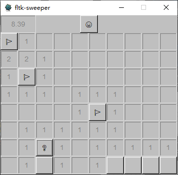

# fltk-rs-sweeper

A simple minesweeper implemented in Rust and [fltk-rs](https://crates.io/crates/fltk).



## Run

Windows user can just download and run the executable.

For other platforms that fltk-rs supports, please setup the fltk dependencies and build locally. Currently it is only tested on Windows. Please feel free to make a PR.

## Build

```
cargo build --release
```
